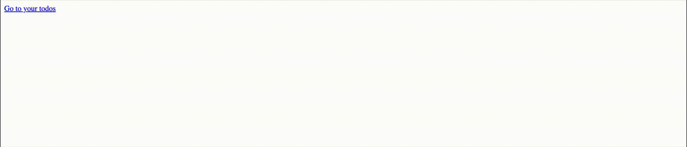

**Todo Appliacation**

- An application where you can list your todos and its tasks.
- Local Ollama LLM AI integration for a quick short tip on how to do a particular task efficiently.

*Logic*

Frotend is built with Svelte and the backend is a REST API built with Deno and Hono, which communicates with the PostgresSQL database where all the todos and tasks are stored. Database schema changes are managed automatically with Flyway. Docker is used to package the full-stack.

